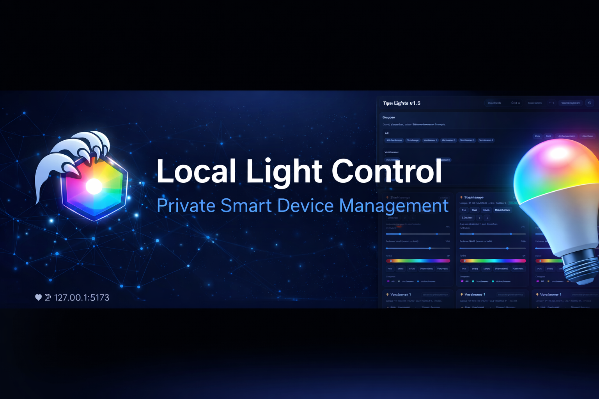
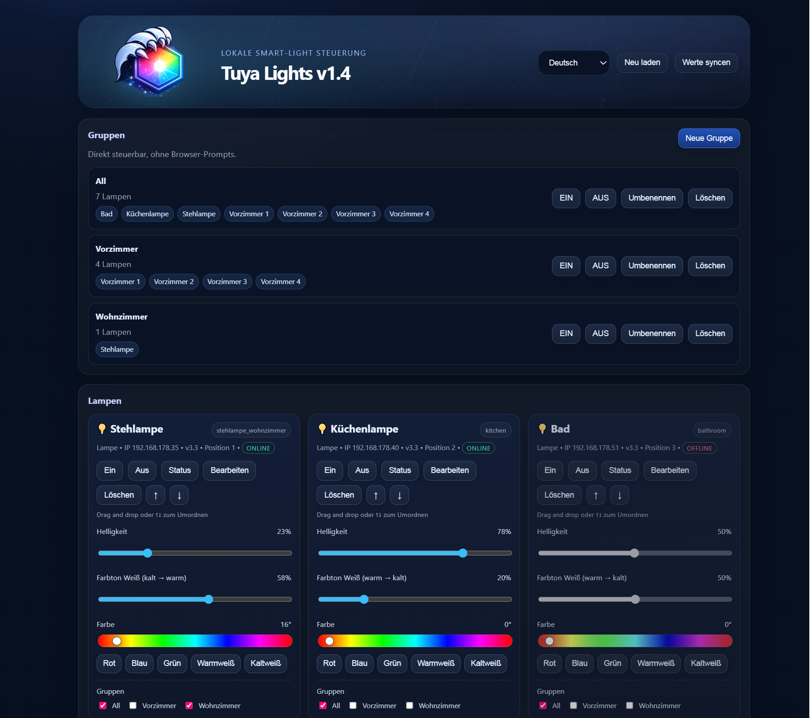
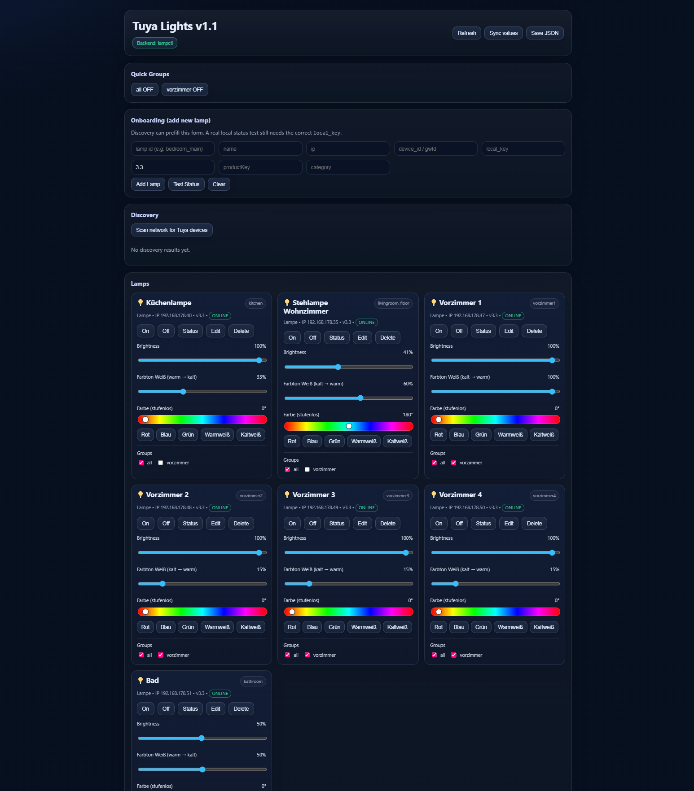

# openclaw-tuya-lights



Fast local Tuya light control for OpenClaw, centered on a Go-based CLI and a clean web GUI.

This project has now moved to a **Go-first architecture**.
The old Python implementation is no longer part of the active runtime path.
If you still want to keep it around for reference or recovery, place it in a separate `legacy-python/` folder.

## Highlights

- Fast local control via `lampctl`
- Device and group control from one registry
- GUI with:
  - drag-and-drop lamp reordering
  - visual group management
  - clean advanced/debug sections
  - registry validation + repair tools
  - German / English language switcher
- Group commands directly in the CLI
- No Python dependency in the active app path

## Project layout

- `main.go` - CLI entry point
- `internal/` - Go CLI and Tuya LAN protocol code
- `lampctl.exe` - prebuilt Windows CLI binary
- `lampctl-linux-amd64` - prebuilt Linux CLI binary
- `lampctl-macos-amd64` - prebuilt macOS Intel CLI binary
- `lampctl-macos-arm64` - prebuilt macOS Apple Silicon CLI binary
- `gui-v1/` - web GUI and local API backend
- `tuya_lamps.json` - local live registry, ignored by git
- `tuya_lamps.example.json` - sanitized example registry for git
- `tuya_device_catalog.json` - capability metadata used by the GUI
- `FRIDA_HOOK/` - reference material for extracting local keys
- `ONBOARDING.md` - notes for adding or repairing devices
- `KEY_EXTRACTION.md` - local key extraction notes
- `start-gui.bat` - Windows convenience starter

## Quick start

### Windows

```powershell
cd C:\Users\1111\.openclaw\workspace\tuya-lights\gui-v1
npm install
npm start
```

GUI: `http://127.0.0.1:5173`
API: `http://127.0.0.1:4890`

### Linux / Android / Termux

```bash
cd ~/src/tuya-lights/gui-v1
npm install
node start-all.mjs
```

GUI: `http://127.0.0.1:5173`
API: `http://127.0.0.1:4890`

## CLI usage

### Standard lamp actions

```powershell
.\lampctl.exe stehlampe status
.\lampctl.exe stehlampe on
.\lampctl.exe stehlampe off
.\lampctl.exe stehlampe brightness --value 50
.\lampctl.exe stehlampe hue --value 180
.\lampctl.exe discover
```

### Group management

```powershell
.\lampctl.exe group list
.\lampctl.exe group create wohnzimmer
.\lampctl.exe group add wohnzimmer stehlampe_wohnzimmer
.\lampctl.exe group remove wohnzimmer stehlampe_wohnzimmer
.\lampctl.exe group delete wohnzimmer
```

## GUI features

### Daily use

- switch lamps on and off
- set brightness
- set white temperature
- set colors
- reorder lamps
- control groups

### Advanced tools

Hidden behind collapsible sections so the default UI stays clean:

- onboarding for new devices
- discovery scan
- registry diagnostics
- repair / normalize action
- raw JSON editors
- debug log

## Registry model

The live registry is stored in `tuya_lamps.json`.
That file is **local only** and should not be committed with real keys.

For sharing the repo, use `tuya_lamps.example.json` instead.

Important fields:

- `name`
- `device_id`
- `ip`
- `local_key`
- `version`
- `type`
- `dps`
- `sort_order`
- `groups`

## Security

- Never commit real `local_key` values.
- Keep `tuya_lamps.json` local.
- Share only sanitized example registries.
- After re-pairing or network changes, assume the `local_key` may have changed.

## Legacy Python note

The previous Python-based controller is intentionally no longer used by the GUI or backend.
If you still want to preserve it for historical reasons, keep it in a separate `legacy-python/` folder and treat it as unsupported legacy code.

## Why this version is the default now

Compared to the old Python path, the current Go-based version is:

- faster in real use
- simpler to deploy
- easier to ship as a standalone tool
- cleaner to maintain as one supported path
- ready to use with bundled binaries for Windows, Linux, and macOS

## Screenshot



